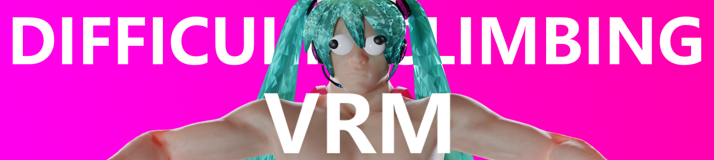
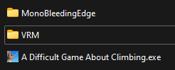

# `⚠️ THIS MOD IS STILL IN EARLY ACCESS ⚠️`

# Difficult Climbing VRM

> _A mod for [ADGAC](https://store.steampowered.com/app/2497920/A_Difficult_Game_About_Climbing) to import custom levels_ 

## Installation
- [Get latest release here](https://github.com/Jor02/DifficultClimbingVRM/releases/latest)
- [Get BepInEx here here](https://github.com/BepInEx/BepInEx/releases/latest)

1. Copy the contents of BepInEx_xxx_x.x.x.x.zip into the directory that contains `A Difficult Game About Climbing.exe` 
(Which would most likely be `C:/Program Files (x86)/Steam/steamapps/common/A Difficult Game About Climbing/`)

2. Start the game for BepInEx to create some extra directories

2. Copy the contents of DifficultClimbingVRM.zip into the `.../Getting Over It/BepInEx/plugins/` directory

## Adding custom player models (wip tutorial)
After running the game once after installing the mod the game should create a `VRM` folder for you in the game directory (configurable in `\BepInEx\config\com.jor02.plugins.difficultclimbingvrm.cfg`)
  
This is where you can put the models you'd like to use ([you can download an example model here](https://github.com/madjin/vrm-samples/raw/master/vroid/stable/AvatarSample_B.vrm))

Since I do not have any in-game gui made yet, you currently have to manually change the `CurrentCharacter` setting in your `\BepInEx\config\com.jor02.plugins.difficultclimbingvrm.cfg` file when you want to change your current player model.

## Third Party Licenses
[UniVRM](https://github.com/vrm-c/UniVRM) is licensed under the [MIT License](https://github.com/vrm-c/UniVRM/blob/master/LICENSE.txt).
